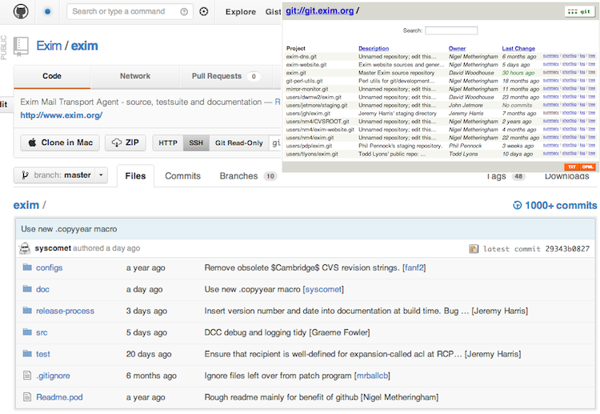

# GoSF

## Quick Intro to using Public Tools with Go

Phil Pennock, Apcera Inc.

<https://github.com/syscomet>

I'll get this talk's git repo up on GitHub after the presentation.

Nomenclature:

* Go Programming Language.
* Golang &mdash; used for disambiguation, in #tags, etc; eg:
  [Twitter #golang](https://twitter.com/search?q=%23golang)
* &ldquo;Go&rdquo; for short, in context.

_(This presentation made with [Landslide](https://github.com/adamzap/landslide).)_

# Presenter Notes

Twenty minutes, so will go quite quickly, but given how established the GoSF
group is, I think folks can handle it readily enough.

Cover git, GitHub, Travis for Continuous Integration, web hooks, git hooks, and
some bits about the build and test frameworks.

---

# Slides as reference, will go quickly

`If I start reading out each slide in a monotone then stop me.`

# Presenter Notes

The slides will be available as reference material.

---

# Go Docs & Playground

Most Go presentations seem to reference various features provided by the Go
project itself.  We'll keep that to just this slide.

You should definitely know about the online documentation, a production running
instance of godoc.

1. Run `godoc -http=:6060` and point a web-browser at <http://localhost:6060/>
2. Or just go to <http://golang.org/>

The main other tool you should get in the habit of using is the Go Playground

* <http://play.golang.org/>
* Lets you type code in the browser, run it, share links to it.

**Please**:

* Learning Go: <http://tour.golang.org/> is a great tutorial

# Presenter Notes

Getting the core bits tied to the language itself out of the way; if you don't
know these, start here.

---

# Okay, a second slide

<http://play.golang.org/>

# Presenter Notes

Treat is as your REPL.
Aaand on we go.

---

# Directory Layout

## Boring

Much like `$PATH` or `$CLASSPATH`, building go code uses `$GOPATH`.  On
Unix-like systems, that's a colon-separated list of dirs.  On Windows,
semi-colons are used.  Unlike $PATH, Go uses a fixed layout within each entry.

Run `ls $(go env GOROOT)` to see the system code.  Pick a place to anchor your
main work.  I use `~/src/go`.  So code I write is in `~/src/go/src/...`.
Libraries installed with `go install` go into `~/src/go/pkg/$GOOS_$GOARCH/`,
commands into `~/src/go/bin/`.

If you're writing code that deals with checking stuff out automatically, please
do allow for multiple entries and take just the first element in the list.  In
    shell, that's `${GOPATH%%:*}`.

# Presenter Notes

`$GOPATH` affects where code lives. You need to take the time to understand this.

---

# Automatic Fetching

## Interesting

Much more interesting, `go get`, `go install`, etc can understand if an import
path has a hostname embedded in it and grok how to auto-fetch code, including
dependencies, recursively.  So if you can build entirely using Go project build
rules, everything needed to build can be fetched, if not already present, just
with `go install site.tld/top/level/cmd`.

The details are documented at: <http://golang.org/doc/code.html#remote>

This affects how you write the code:

    !go
    package main
    import "github.com/syscomet/namespace_test"
    func main() {
        namespace_test.Demonstration("Go Steel Programmers")
    }

Downside: hosting site is in the source code.  But the prefix parts of the path
are not part of the code namespace, even without using a renaming import.  Thus
`namespace_test.` and the only parts to change are the import lines.

---

# Should you use `go get` / `go build`?

* Simple projects
* Open Source Projects
* Getting started, absolutely
* Scaling issues; breaks relative imports, _very_ tied into hosting provider
* Ties into the suitability of `go build`
* Simplicity is a virtue, especially when it's time to move away

* For this talk, yes.

# Presenter Notes

An opinion which might inflame.

There is always a trade-off in build-systems between simplicity and power.
Often, eg in Java, folks start with something simple because they don't need
the power.  Then they make a few tweaks, just to add the one _little_ bit needed.
By the time they switch to something more powerful, they have a huge tangled mess
to deal with.

Go gets around this: it supplies a simple system with no configuration files,
which handles many basic cases but doesn't _let_ you invest effort into creating
a tangled mess.  By the time you're ready to move past `go build`, you know what
you need, you know what to look for, and can choose a build framework to suit.
Porting is simple, because there's just the standard rules.

Telling that Google talks have mentioned `google/` as their namespace, which does
not use automatic fetching.

---

# Git

That was a code fetch using a version control system.  Go supports several.  It
doesn't matter much which you use, but Git is currently the In Thing with wide
support and some nice features.

It doesn't matter too much which version control system you use, as long as Go
supports it.

Beware: Git also has horribly bad default command-line commands (the
"porcelain"), with an attitude of "just write porcelain which does what you
want", combining with traditional geek macho, to keep the default commands
complicated and confusing until you get used to them.

It's powerful, it's good, but don't try learning Git all at once and accept
that you'll learn it in bits and pieces.

Git further reading:

* `git help tutorial`
* `git help tutorial-2`
* `git help gitcore-tutorial`
* <http://www-cs-students.stanford.edu/~blynn/gitmagic/>

---

# Git Tools

 * `git instaweb` &mdash; runs a web-server wrapper around `gitweb.cgi` and
    points a browser at it, for browsing the repo.

        !ini
        [browser "firefox"]
            path = /Applications/Firefox.app/Contents/MacOS/firefox
        [instaweb]
            local = true
            browser = firefox

* Storing password credentials in OSX keychain, or other native password
  management, is worthwhile to set up.

        !ini
        [credential]
            helper = osxkeychain

* Passphrase-based SSH with ssh-agent is your friend; set the public keys
  for the services you want to access.

# Presenter Notes

You should do these things to Git if you haven't already done so; `git instaweb`
fires up a web-browser talking to an ad-hoc web-server, showing the gitweb.cgi
view of the current repository.

Credential helpers rock.

---

# Distributed Version Control

Basic revision control lets you check in files, check them out, check in
changes, and look back to get the content at any previous point in time,
generating diffs as wanted.  Where you check them into might be a sub-directory
(SCCS, RCS), a central server, or "anywhere".

In place of a mandatory central server, DVCS have a model where folks don't
normally retrieve just the most recent version.  Instead, they keep a local
copy of the entire history so that most operations are local.

The content can then be reconciled between instances, on the same host or
remotely, over HTTP, SSH or other stuff, depending upon the DVCS.

Once you have this, you can _choose_ to make some location canonical, or
preferred, particularly if it provides useful additional tools.

# Presenter Notes

Distributed version control: no imposed authority, only the authority
you choose to submit to.

If you stick with the default build system, then yes, you've chosen to
make some location canonical.

---

# Exim (not Go)

Exim uses Git, the canonical store is on [git.exim.org](http://git.exim.org/).
But we also use GitHub, <https://github.com/Exim/exim>.  Pushes to the
canonical store are automatically pushed to GitHub.

# Presenter Notes

As an example of this distributed nature, Exim has its own canonical location,
_and_ uses GitHub for some hooks (covered later).  The image in the top-right is
gitweb on the canonical server, the main image is the GitHub mirror.

---

# GitHub

I'm using GitHub for this talk.  I don't work for them.  But they're decent and
there's a reason I'm using them as the example, and that my employer uses them
and an Open Source project I'm involved with increasingly uses them.

There are a few sites providing Git hosting with augmented tools.  Currently,
probably the most popular is GitHub.  Free unlimited hosting for public
repositories, my employer is a customer of the private repository support.

At a low level, the most important thing provided is a production-quality
staffed Git hosting facility, available over a couple of protocols, with decent
authentication infrastructure.

On top of that, are some decent sharing tools for choosing who gets commit
access, some adequate light code review and bug-tracking systems (optional),
wiki hosting, site hosting for simple static sites which are git checkouts.

And then the magic: hooks

# Presenter Notes

Pretty darned solid git hosting, for a price that's right for open source,
professionally backed, with nice custom tools that can be addictive.  If you
haven't used their lightweight code review and issue tracking systems, you
really should take a look.  The checkbox feature on the issues system is one
of their great recent additions.

Biggest downside: issues aren't themselves available as a git repo, AFAICT.

---

# GitHub Hooks

Post commit details to IRC, trigger regression tests, update bug-tracking systems &hellip;

A webhook, fundamentally, is &ldquo;take some data representing an event, POST
it to a URL, and perhaps take action based on the response code&rdquo;.

Add authorisation tokens that can be embedded in a URL, and a standard encoding
format (typically JSON) and you're getting somewhere.

Add in a protocol translator site, taking site A's event and changing it to
something understood by site B and you have something powerful.  Provide a
library of those translations as part of the generating site and you can:

1. talk natively to a wide variety of sites with very simple template values
   supplied
2. generate the data to let folks plug code into _any_ other site.

https://github.com/$account/$project/admin/hooks
Eg: <https://github.com/syscomet/sks_spider/admin/hooks>

# Presenter Notes

Webhooks are powerful and your friend, as is having a common language so that
at most you need to do some minor data model munging to glue two systems
together.

Going into a little more detail: something has happened, you POST about it,
don't care about what happens on the remote side.  IRC notifications, Android/iOS,
continuous integration and more.

---

# Example project: sks\_spider

Don't worry about it.  Code was a weekend migration hack, is pretty ugly in
places.

This is just some code I wrote, rewriting a Python WSGI app to be a Golang
HTTP server; in the process, it became faster and more responsive, using less
CPU and less RAM.  I'm using it as an example because it's on GitHub, has
tests, and is using Travis CI for Continuous Integration testing.

Not relevant, but context: PGP keyservers hold public keys, this maps the
peering meshes for statistics and building DNS pools.
See <http://sks.spodhuis.org/sks-peers> if you really care.

# Presenter Notes

Seriously, don't worry about what the code does, it's just a suitable demo.

Waffle re PGP keyservers if folks are interested; public keys & signatures
in WoT; SKS, written oCaml, reconciliation; peering, peering mesh.  sks\_spider
walks the mesh, checking status, counting keys, lets public pools of servers
be published in DNS. This is a research/exploration project, not the code used
for the main public pool, but has influenced that code in friendly competition.

---

# Downside to `sks_spider`

I used a btree project which was written using the gotgo preprocessor to
support templates. It's powerful and pleasant, but not at all supported by the
normal build system.

Downside: normal build process doesn't work

Upside: I get to show a bit more about Travis configuration

# Presenter Notes

Code generation is an example of the limited power of the default build system.
That it happens to be gotgo in this case is irrelevant, it could as well be
`go tool yacc`.

---

# `go test`

The Go build system will skip files with names matching `*_test.go` when
creating a library or binary; instead, the `go test` command takes those files
and combines them into a test binary, supplying `func main()` itself.

Functions with signatures matching `func TestFoo(t *testing.T)` for some Foo
will be candidates for running in a test.

The `sks_spider` program currently has too few tests, but it has some: Go makes
it easy and I'm gradually building them up.

    % go test -v github.com/syscomet/sks_spider
    === RUN TestCountrySpodhuis
    --- PASS: TestCountrySpodhuis (0.01 seconds)
    === RUN TestCountrySets
    --- PASS: TestCountrySets (0.00 seconds)
    countries_test.go:80:   Countryset OK: NL,UK,US
    === RUN TestDepthSnapshot
    --- PASS: TestDepthSnapshot (0.02 seconds)
    depth_test.go:55:       Depth OK; 84 entries, max distance 3
    PASS
    ok      github.com/syscomet/sks_spider  0.048s

# Presenter Notes

A build system which provides for documentation and tests as part of it, is a nice
low bar to set for the competition.  Use it, take advantage of it, don't give this
up if you move away.  You don't get to control `main()` for tests, you just get to
create stand-alone units that plug in.

---

# Test or Check

* <http://labix.org/gocheck>: `gocheck` is, I'm told, a better testing framework for apps:

> The Go language provides an internal testing library, named testing, which is relatively slim due to the fact that the standard library correctness by itself is verified using it. The gocheck package, on the other hand, expects the standard library from Go to be working correctly, and builds on it to offer a richer testing framework for libraries and applications to use.

# Presenter Notes

Using `go test` as a base, `go check` is worth looking at.

The same person who recommended it to me has gone back to mostly using `go
test`, because it's "just there".

---

# Digression: test what, where?

If you keep your tests in the same directory:

* In namespace
* Get to test the internals

If you put tests in a sub-directory:

* Need to know absolute import path to reach normal code
* Get to test as a client would, so `Example*()` tests look like real client code
* You unit-test the presented API, not details

Both are useful.

# Presenter Notes

There are two approaches to where to place tests.  They both have use and it can
make sense to use both.  If in the same directory, you're inside the package.
If in a sub-directory, you import as per normal, so your API-documenting Example\*
tests use the code just as the client would; in these tests, you're checking the
API, the _what_. In-package, you're testing the _how_ and that the _how_ works.

---

# Continuous Integration

Loosely: every time you push a change to the repository, it triggers a CI
system to fetch the code, build it, run the tests and report the results.  When
it generates a status badge, you can include that badge into even README.md
files to provide a convenient status report.  APIs will let you build more
comprehensive dashboards.

<https://travis-ci.org/syscomet/sks_spider>

My employer pays for Travis, they've been very responsive with Golang issues,
we're happy.  Free public service covers Go too (and is what sks\_spider uses).

# Presenter Notes

Continuous Integration is worth doing, always. Travis is free for open source
projects and has a commercial offering, they support Go. The biggest competition
is probably self-hosting Jenkins.

Continuous Integration: every time (by default) that you push a change, the code gets
rebuilt and the tests run.

---

# Travis CI

Two ways to configure the pairing GitHub &lrarr; Travis link:

1. Step through the process carefully, [it's documented](http://about.travis-ci.org/docs/user/how-to-setup-and-trigger-the-hook-manually/)
2. Grant Travis CI (via OAuth) permission to make the changes to your GitHub repo for you.

It basically boils down to generating a token on the Travis site, and
configuring a commit hook on GitHub.  Since it's a public repository, there's
no auth required to fetch the content.  Things are more involved for private
repositories.  Then, by default, pushes will trigger a test.  That simple?

# Presenter Notes

If you're working with a public repo, just tell Travis to make the changes; it's
git, you have copies, you can always revert.  The private repo method is evolving
and becoming simpler, and I won't go into it here.

If you do need to set things up manually, the link in this slide will take you to
the correct part of the docs.

---

# .travis.yml

Okay, you need to tell Travis _how_ to test your project.  Most simply:

    !yaml
    language: go

That's it.
Because Go has a built-in test framework, that's normally all that's needed.

The configuration is in YAML and the most relevant additional top-level keys
are `script` and `install`, each of which can be a list of multiple steps.

In Travis, the steps are combined into shell input, so you can set variables
in earlier steps and use them in later steps.

Used to be correct for Automatic Fetching, they'll fix it; for Go, Travis will
create `~/gopath/src` and `export GOPATH=~/gopath` and `go get` paths work, but
by default layout for _current_ repo is not presently inside `$GOPATH`. ☹

The content is pulled as a git checkout of the version that triggered a commit,
linked into place, and your current working directory is inside your project
dir, so that you can access `data/` files with relative paths.  Next slide
shows fixups.

# Presenter Notes

The configuration file is simple YAML; this talk is badly timed for Travis,
they recently pushed something unfortunate, they're fixing it.

---

# A better .travis.yml

    !yaml
    language: go

    script:
     - go vet
     - go test -v

The `go vet` command will catch things like .Printf() calls with mismatches in
%-expandos against the supplied arguments.  I've not seen a false positive yet,
thus so far I consider it a test failure if `go vet` complains.

Use `travis-lint`

# Presenter Notes

Use `travis-lint`.  `go vet` is **nice**.

---

# .travis.yml with install location fixups

Hopefully not needed by the time you try this.

    !yaml
    language: go

    install:
     - CANONICAL="github.com/username/frobozz"
     - here=$(/bin/pwd -P)
     - TOP="${GOPATH%%:*}/src"
     - "if ! [ -d \"$TOP/$CANONICAL\" ]; then ⏎
       mkdir -pv \"$TOP/$(dirname $CANONICAL)\" ⏎
       && ln -s \"$here\" \"$TOP/$CANONICAL\"; fi"
     - cd \"$TOP/$CANONICAL\"
     - go get -d -v
     - go build -v frobozz.go
     - go test -i

[The ⏎ is purely to mark slide-fitting linebreaks you should skip]

---

# sks\_spider .travis.yml

This is the complexity you create for yourself by breaking out of pure Go build
compatibility.  You probably want to move most of the work into an `install.sh`
script, or something using your build framework.

    !yaml
    language: go

    install:
     - repo_dir=$(/bin/pwd -P)
     - spider_parent="github.com/syscomet"
     - SPIDER_DIR="github.com/syscomet/sks_spider"
     - BTREE_DIR="github.com/runningwild/go-btree"
     - GOTGO_DIR="github.com/droundy/gotgo/gotgo"
     - CHECKOUT_TOP="${GOPATH%%:*}/src"
     - "if ! [ -d \"$CHECKOUT_TOP/$spider_parent\" ]; then mkdir -pv \"$CHECKOUT_TOP/$spider_parent\" && ln -s \"$repo_dir\" \"$CHECKOUT_TOP/$SPIDER_DIR\"; fi"
     - go get -fix -d -v "$BTREE_DIR"
     - "( cd \"$CHECKOUT_TOP/$BTREE_DIR\" && rm bench.go test.go )"
     - go get -d "$GOTGO_DIR"
     - go build -v "$GOTGO_DIR"
     - ./gotgo -o "$CHECKOUT_TOP/$BTREE_DIR/btree.go" "$CHECKOUT_TOP/$BTREE_DIR/btree.got" string
     - go get -d -v
     - go build -v sks_stats_daemon.go
     - go test -i

---

# Too hot!  Too cold!

By default, Travis runs on every commit.  This is good when your first commits
to get Travis working are on a `travis_setup` branch.

Quickly, you get to where you want commits, say, only on the main branch and on
pull requests.  Configure it, and it shall be so.
This too goes in `.travis.yml`.

Magic phrase in commit message: `[ci skip]`

Recent addition: easy UI to force a retry when something failed because of a
transient glitch (eg, fetch from GitHub failed).

---

# Example skip commit

    commit 796ceba300fd8d88064808220e070a243d15036f
    Author: Phil Pennock <pdp@spodhuis.org>
    Date:   Sun Jan 20 01:11:30 2013 -0500

        Copyright year updates.

            vi $(git whatchanged --since=2013-01-01 | grep '^:100' | ⏎
             sed 's/^[^M]*M//' | sort -u )

        [ci skip]

---

# Git pre-commit

You can't run your own code on GitHub to verify a push.
It's not your service and the security implications would be awkward.
If you run your own central repository, you **can** do this.

You can run pre-commit scripts to check before you even commit into your local
repository.  But beware that the pre-commit scripts are not natively part of
the repository, because you shouldn't be running arbitrary unseen code when you
run a local git command whenever you pull content.

So `$repo/.git/hooks/pre-commit` will need to be manually created when you set
up your checkout.

A good approach is to keep a collection of trusted pre-commit scripts in a repo.

A trusting approach is to create `git-hooks/` within your repo and create
`pre-commit` as a symlink pointing to `../../git-hooks/pre-commit` &mdash; instant
security hole, if anyone else can commit.

<https://github.com/syscomet/sks_spider/blob/master/git-hooks/pre-commit>

# Presenter Notes

Done this with sks\_spider for demonstration purposes and to provide a reference;
hopefully will remember to remove should I ever grant someone else push access.

---

# Pre-commit steps

1. Use `foo=$(git config hooks.foo)` to grab any config items from
   `$repo/.git/config`
2. The content in the working directory at the time is not the content being
   committed; you need to ensure that what you test is what's part of the commit.
    * git stash --keep-index --all --quiet
    * git reset --hard --quiet; git stash pop --index --quiet
3. We run the first two of these by default, the second two only if asked:
    1. go vet
    2. go fmt -l -e $File
    3. go build
    4. go test

Further, additional build targets can be added, to exercise the `package main`
wrappers.

BSD license on [sks\_spider pre-commit](https://github.com/syscomet/sks_spider/blob/master/git-hooks/pre-commit)
and is a good place to start.

---

# Fin

Will be linked to from the meetup page.

&copy; 2012, 2013 Apcera, Inc.

This work is licensed under a
<a rel="license" href="http://creativecommons.org/licenses/by/3.0/us/deed.en_US">Creative Commons Attribution 3.0 United States License</a>.

<!-- vim: set sw=4 et wrap : -->
